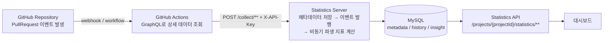
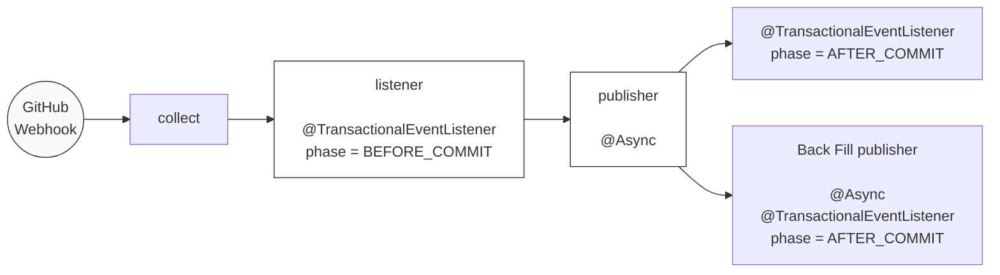

# Statistics Server

GitHub PullRequest 활동 데이터를 실시간으로 수집하고, 팀의 개발 프로세스를 분석하여 통계를 제공하는 서버입니다.

## 아키텍처



## 이벤트 처리 파이프라인



- **BEFORE_COMMIT** — PullRequest, Review, Label, Comment 메타데이터와 변경 이력을 트랜잭션 내에서 저장
- **AFTER_COMMIT** — 파생 지표(lifecycle, review activity, response time 등) 비동기 계산
- **Back Fill** — PullRequest ID가 확정되기 전에 생성된 레코드의 연결을 후처리

## 주요 특징

- **14종 PullRequest 이벤트 수집** — opened, closed, synchronize, label, review, comment 등
- **3계층 데이터 저장** — 메타데이터(현재 상태) + 히스토리(변경 이력) + 인사이트(파생 지표)
- **트랜잭션 경계 분리** — 원본 데이터는 트랜잭션 내 저장, 파생 지표는 커밋 후 비동기 계산
- **멱등성 보장** — GitHub ID 기반 UNIQUE 제약조건으로 중복 수신 방어
- **동시성 제어** — 비관적 락 + 최신 데이터 판별(isNewer)로 이벤트 순서 비보장 환경 대응
- **프로젝트별 통계 설정** — Core Time, Size Weight, Size Grade Threshold

## 저장 계층

`analysis/metadata`와 `analysis/insight` 두 패키지로 구분됩니다.

| 패키지 | 역할 | 포함 도메인 |
|--------|------|-------------|
| `metadata` | 현재 상태 원본 + 변경 이력 | PullRequest, Commit, File, Label, Review, ReviewComment, RequestedReviewer 및 각 history |
| `insight` | 커밋 후 비동기로 계산되는 파생 지표 | lifecycle, activity, review, comment, size, bottleneck |

> 각 Entity의 상세 스펙은 [Wiki](https://github.com/pr-ism/statistics-server/wiki/Metadata-%EB%8F%84%EB%A9%94%EC%9D%B8)를 참고해 주세요.

## API

전체 요청/응답 스키마는 실행 후 `/docs/index.html`에서 확인할 수 있습니다.

| 구분 | 경로 | 인증 |
|------|------|------|
| 수집 (14개) | `POST /collect/**` | X-API-Key |
| 통계 (15개) | `GET /projects/{projectId}/statistics/**` | Bearer Token |
| 프로젝트 설정 | `/projects/{projectId}/settings/**` | Bearer Token |
| 사용자 | `/users/me`, `/refresh-token` | Bearer Token |

## 기술 스택

- Java 21, Spring Boot 3.5
- Spring Data JPA, QueryDSL
- Spring Security, OAuth2 Client (Kakao, Google)
- MySQL, H2 (local)
- Spring REST Docs

## 개발 환경

```bash
# 테스트
./gradlew test

# 빌드 (REST Docs 생성 포함)
./gradlew build
```

