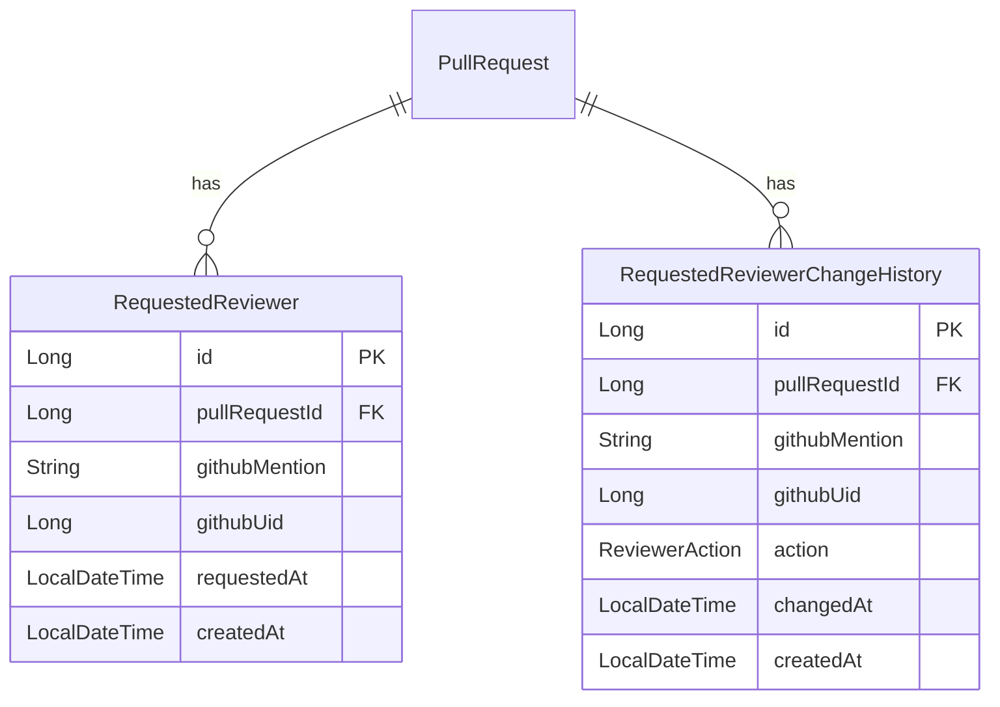

# PR Reviewer 이벤트 스펙

## 개요

PR에 리뷰어가 요청/삭제될 때 발생하는 이벤트입니다. `review_requested`와 `review_request_removed` 이벤트를 각각 다른 엔드포인트로 처리합니다.

## 수집 대상 원천 메타데이터 (데이터.pdf 기준)

| 원천 메타 데이터 | 영어 표기 | 설명 |
|----------------|----------|------|
| 요청된 리뷰어 | requested_reviewer | PR에 리뷰어로 지정된 사람 |
| 리뷰어 추가 시각 | reviewer_added_at | 리뷰어가 지정된 시각 |

## 수집 대상 Entity

| Entity | 설명 |
|--------|------|
| RequestedReviewer | 현재 PR에 요청된 리뷰어 (현재 상태) |
| RequestedReviewerChangeHistory | 리뷰어 요청/삭제 이력 |



---

## GitHub Actions Workflow

`pr-data-collector.yml`에 통합되어 있습니다.

```yaml
name: PR Data Collector

on:
  pull_request:
    types: [opened, labeled, unlabeled, review_requested, review_request_removed]

env:
  WEBHOOK_URL: ${{ secrets.STATISTICS_WEBHOOK_URL }}

jobs:
  collect-pr-data:
    runs-on: ubuntu-latest
    steps:
      - name: Handle opened event
        if: github.event.action == 'opened'
        env:
          GH_TOKEN: ${{ secrets.GITHUB_TOKEN }}
        run: |
          PR_DATA=$(gh api graphql -f query='
            query($owner: String!, $repo: String!, $number: Int!) {
              repository(owner: $owner, name: $repo) {
                pullRequest(number: $number) {
                  number
                  title
                  url
                  additions
                  deletions
                  changedFiles
                  createdAt
                  author { login }
                  commits(first: 100) {
                    totalCount
                    nodes {
                      commit {
                        oid
                        committedDate
                      }
                    }
                  }
                }
              }
            }
          ' -f owner='${{ github.repository_owner }}' \
            -f repo='${{ github.event.repository.name }}' \
            -F number=${{ github.event.pull_request.number }})

          FILES_DATA=$(gh api \
            "repos/${{ github.repository }}/pulls/${{ github.event.pull_request.number }}/files" \
            --jq '[.[] | {filename, status, additions, deletions}]')

          PAYLOAD=$(jq -n \
            --argjson prData "$PR_DATA" \
            --argjson files "$FILES_DATA" \
            --arg repositoryFullName "${{ github.repository }}" \
            --argjson isDraft "${{ github.event.pull_request.draft }}" \
            '{
              eventType: "pull_request",
              action: "opened",
              repositoryFullName: $repositoryFullName,
              isDraft: $isDraft,
              pullRequest: $prData.data.repository.pullRequest,
              files: $files
            }')

          if [ -n "$WEBHOOK_URL" ]; then
            curl -X POST \
              -H "Content-Type: application/json" \
              -H "X-API-Key: ${{ secrets.PRISM_API_KEY }}" \
              -d "$PAYLOAD" "$WEBHOOK_URL/pr/opened" --fail --silent --show-error
          fi

      - name: Handle labeled event
        if: github.event.action == 'labeled'
        run: |
          PAYLOAD=$(jq -n \
            --arg repositoryFullName "${{ github.repository }}" \
            --argjson prNumber "${{ github.event.pull_request.number }}" \
            --arg labelName "${{ github.event.label.name }}" \
            --arg labeledAt "$(date -u +%Y-%m-%dT%H:%M:%SZ)" \
            '{
              repositoryFullName: $repositoryFullName,
              prNumber: $prNumber,
              label: {
                name: $labelName
              },
              labeledAt: $labeledAt
            }')

          if [ -n "$WEBHOOK_URL" ]; then
            curl -X POST \
              -H "Content-Type: application/json" \
              -H "X-API-Key: ${{ secrets.PRISM_API_KEY }}" \
              -d "$PAYLOAD" "$WEBHOOK_URL/label/added" --fail --silent --show-error
          fi

      - name: Handle unlabeled event
        if: github.event.action == 'unlabeled'
        run: |
          PAYLOAD=$(jq -n \
            --arg repositoryFullName "${{ github.repository }}" \
            --argjson prNumber "${{ github.event.pull_request.number }}" \
            --arg labelName "${{ github.event.label.name }}" \
            --arg unlabeledAt "$(date -u +%Y-%m-%dT%H:%M:%SZ)" \
            '{
              repositoryFullName: $repositoryFullName,
              prNumber: $prNumber,
              label: {
                name: $labelName
              },
              unlabeledAt: $unlabeledAt
            }')

          if [ -n "$WEBHOOK_URL" ]; then
            curl -X POST \
              -H "Content-Type: application/json" \
              -H "X-API-Key: ${{ secrets.PRISM_API_KEY }}" \
              -d "$PAYLOAD" "$WEBHOOK_URL/label/removed" --fail --silent --show-error
          fi

      - name: Handle review_requested event
        if: github.event.action == 'review_requested'
        run: |
          PAYLOAD=$(jq -n \
            --argjson prNumber "${{ github.event.pull_request.number }}" \
            --arg login "${{ github.event.requested_reviewer.login }}" \
            --argjson id "${{ github.event.requested_reviewer.id }}" \
            --arg requestedAt "$(date -u +%Y-%m-%dT%H:%M:%SZ)" \
            '{
              prNumber: $prNumber,
              reviewer: {
                login: $login,
                id: $id
              },
              requestedAt: $requestedAt
            }')

          if [ -n "$WEBHOOK_URL" ]; then
            curl -X POST \
              -H "Content-Type: application/json" \
              -H "X-API-Key: ${{ secrets.PRISM_API_KEY }}" \
              -d "$PAYLOAD" "$WEBHOOK_URL/reviewer/added" --fail --silent --show-error
          fi

      - name: Handle review_request_removed event
        if: github.event.action == 'review_request_removed'
        run: |
          PAYLOAD=$(jq -n \
            --argjson prNumber "${{ github.event.pull_request.number }}" \
            --arg login "${{ github.event.requested_reviewer.login }}" \
            --argjson id "${{ github.event.requested_reviewer.id }}" \
            --arg removedAt "$(date -u +%Y-%m-%dT%H:%M:%SZ)" \
            '{
              prNumber: $prNumber,
              reviewer: {
                login: $login,
                id: $id
              },
              removedAt: $removedAt
            }')

          if [ -n "$WEBHOOK_URL" ]; then
            curl -X POST \
              -H "Content-Type: application/json" \
              -H "X-API-Key: ${{ secrets.PRISM_API_KEY }}" \
              -d "$PAYLOAD" "$WEBHOOK_URL/reviewer/removed" --fail --silent --show-error
          fi
```

---

## Payload 구조

### Reviewer Added (review_requested)

```json
{
  "prNumber": 1,
  "reviewer": {
    "login": "reviewer-username",
    "id": 12345
  },
  "requestedAt": "2024-01-15T10:00:00Z"
}
```

### Reviewer Removed (review_request_removed)

```json
{
  "prNumber": 1,
  "reviewer": {
    "login": "reviewer-username",
    "id": 12345
  },
  "removedAt": "2024-01-15T11:00:00Z"
}
```

---

## Server DTO

위치: `application/webhook/dto/request/`

### ReviewerAddedRequest.java

```java
public record ReviewerAddedRequest(
    int prNumber,
    ReviewerData reviewer,
    Instant requestedAt
) {
    public record ReviewerData(
        String login,
        Long id
    ) {}
}
```

### ReviewerRemovedRequest.java

```java
public record ReviewerRemovedRequest(
    int prNumber,
    ReviewerData reviewer,
    Instant removedAt
) {
    public record ReviewerData(
        String login,
        Long id
    ) {}
}
```

---

## Entity 설계

### RequestedReviewer (현재 리뷰어 상태)

위치: `domain/reviewer/RequestedReviewer.java`

| Payload 필드 | Entity 필드 | 변환 |
|-------------|-------------|------|
| reviewer.login | githubMention | 직접 매핑 |
| reviewer.id | githubUid | 직접 매핑 |
| requestedAt | requestedAt | Instant → LocalDateTime |
| prNumber | pullRequestId | Project 조회 → PR 조회 후 연결 |

```java
@Getter
@Entity
@Table(name = "requested_reviewers")
@NoArgsConstructor(access = AccessLevel.PROTECTED)
public class RequestedReviewer extends CreatedAtEntity {

    private Long pullRequestId;

    private String githubMention;

    private Long githubUid;

    private LocalDateTime requestedAt;

    public static RequestedReviewer create(
            Long pullRequestId,
            String githubMention,
            Long githubUid,
            LocalDateTime requestedAt
    ) {
        validatePullRequestId(pullRequestId);
        validateGithubMention(githubMention);
        validateGithubUid(githubUid);
        validateRequestedAt(requestedAt);
        return new RequestedReviewer(pullRequestId, githubMention, githubUid, requestedAt);
    }

    private static void validatePullRequestId(Long pullRequestId) {
        if (pullRequestId == null) {
            throw new IllegalArgumentException("PR ID는 필수입니다.");
        }
    }

    private static void validateGithubMention(String githubMention) {
        if (githubMention == null || githubMention.isBlank()) {
            throw new IllegalArgumentException("GitHub 멘션은 필수입니다.");
        }
    }

    private static void validateGithubUid(Long githubUid) {
        if (githubUid == null) {
            throw new IllegalArgumentException("GitHub UID는 필수입니다.");
        }
    }

    private static void validateRequestedAt(LocalDateTime requestedAt) {
        if (requestedAt == null) {
            throw new IllegalArgumentException("리뷰어 요청 시각은 필수입니다.");
        }
    }

    private RequestedReviewer(
            Long pullRequestId,
            String githubMention,
            Long githubUid,
            LocalDateTime requestedAt
    ) {
        this.pullRequestId = pullRequestId;
        this.githubMention = githubMention;
        this.githubUid = githubUid;
        this.requestedAt = requestedAt;
    }
}
```

### RequestedReviewerChangeHistory (리뷰어 변경 이력)

위치: `domain/reviewer/RequestedReviewerChangeHistory.java`

| Payload 필드 | Entity 필드 | 변환 |
|-------------|-------------|------|
| reviewer.login | githubMention | 직접 매핑 |
| reviewer.id | githubUid | 직접 매핑 |
| - | action | REQUESTED 또는 REMOVED |
| requestedAt / removedAt | changedAt | Instant → LocalDateTime |
| prNumber | pullRequestId | Project 조회 → PR 조회 후 연결 |

```java
@Getter
@Entity
@Table(name = "requested_reviewer_change_histories")
@NoArgsConstructor(access = AccessLevel.PROTECTED)
public class RequestedReviewerChangeHistory extends CreatedAtEntity {

    private Long pullRequestId;

    private String githubMention;

    private Long githubUid;

    @Enumerated(EnumType.STRING)
    private ReviewerAction action;

    private LocalDateTime changedAt;

    public static RequestedReviewerChangeHistory create(
            Long pullRequestId,
            String githubMention,
            Long githubUid,
            ReviewerAction action,
            LocalDateTime changedAt
    ) {
        validatePullRequestId(pullRequestId);
        validateGithubMention(githubMention);
        validateGithubUid(githubUid);
        validateAction(action);
        validateChangedAt(changedAt);
        return new RequestedReviewerChangeHistory(pullRequestId, githubMention, githubUid, action, changedAt);
    }

    private static void validatePullRequestId(Long pullRequestId) {
        if (pullRequestId == null) {
            throw new IllegalArgumentException("PR ID는 필수입니다.");
        }
    }

    private static void validateGithubMention(String githubMention) {
        if (githubMention == null || githubMention.isBlank()) {
            throw new IllegalArgumentException("GitHub 멘션은 필수입니다.");
        }
    }

    private static void validateGithubUid(Long githubUid) {
        if (githubUid == null) {
            throw new IllegalArgumentException("GitHub UID는 필수입니다.");
        }
    }

    private static void validateAction(ReviewerAction action) {
        if (action == null) {
            throw new IllegalArgumentException("리뷰어 액션은 필수입니다.");
        }
    }

    private static void validateChangedAt(LocalDateTime changedAt) {
        if (changedAt == null) {
            throw new IllegalArgumentException("변경 시각은 필수입니다.");
        }
    }

    private RequestedReviewerChangeHistory(
            Long pullRequestId,
            String githubMention,
            Long githubUid,
            ReviewerAction action,
            LocalDateTime changedAt
    ) {
        this.pullRequestId = pullRequestId;
        this.githubMention = githubMention;
        this.githubUid = githubUid;
        this.action = action;
        this.changedAt = changedAt;
    }
}
```

### ReviewerAction Enum

위치: `domain/reviewer/enums/ReviewerAction.java`

```java
public enum ReviewerAction {
    REQUESTED,
    REMOVED;
}
```

---

## Repository 설계

### RequestedReviewerRepository (Domain Interface)

위치: `domain/reviewer/repository/RequestedReviewerRepository.java`

```java
public interface RequestedReviewerRepository {

    RequestedReviewer save(RequestedReviewer requestedReviewer);

    boolean exists(Long pullRequestId, Long githubUid);

    long delete(Long pullRequestId, Long githubUid);
}
```

> **참고**: `delete`가 `long`을 반환하여 삭제 여부를 명시적으로 검증

### RequestedReviewerChangeHistoryRepository (Domain Interface)

위치: `domain/reviewer/repository/RequestedReviewerChangeHistoryRepository.java`

```java
public interface RequestedReviewerChangeHistoryRepository {

    RequestedReviewerChangeHistory save(RequestedReviewerChangeHistory requestedReviewerHistory);
}
```

### JpaRequestedReviewerRepository

위치: `infrastructure/reviewer/persistence/JpaRequestedReviewerRepository.java`

```java
public interface JpaRequestedReviewerRepository extends ListCrudRepository<RequestedReviewer, Long> {
}
```

### JpaRequestedReviewerChangeHistoryRepository

위치: `infrastructure/reviewer/persistence/JpaRequestedReviewerChangeHistoryRepository.java`

```java
public interface JpaRequestedReviewerChangeHistoryRepository extends ListCrudRepository<RequestedReviewerChangeHistory, Long> {
}
```

### RequestedReviewerRepositoryAdapter

위치: `infrastructure/reviewer/persistence/RequestedReviewerRepositoryAdapter.java`

```java
@Repository
@RequiredArgsConstructor
public class RequestedReviewerRepositoryAdapter implements RequestedReviewerRepository {

    private final JpaRequestedReviewerRepository jpaRequestedReviewerRepository;
    private final JPAQueryFactory queryFactory;

    @Override
    @Transactional
    public RequestedReviewer save(RequestedReviewer requestedReviewer) {
        return jpaRequestedReviewerRepository.save(requestedReviewer);
    }

    @Override
    @Transactional(readOnly = true)
    public boolean exists(Long pullRequestId, Long githubUid) {
        Long id = queryFactory
                .select(requestedReviewer.id)
                .from(requestedReviewer)
                .where(
                        requestedReviewer.pullRequestId.eq(pullRequestId),
                        requestedReviewer.githubUid.eq(githubUid)
                )
                .fetchOne();
        return id != null;
    }

    @Override
    @Transactional
    public long delete(Long pullRequestId, Long githubUid) {
        return queryFactory
                .delete(requestedReviewer)
                .where(
                        requestedReviewer.pullRequestId.eq(pullRequestId),
                        requestedReviewer.githubUid.eq(githubUid)
                )
                .execute();
    }
}
```

---

## Service 설계

### ReviewerAddedService

위치: `application/webhook/ReviewerAddedService.java`

```java
@Service
@RequiredArgsConstructor
public class ReviewerAddedService {

    private final Clock clock;
    private final ProjectRepository projectRepository;
    private final PullRequestRepository pullRequestRepository;
    private final RequestedReviewerRepository requestedReviewerRepository;
    private final RequestedReviewerChangeHistoryRepository requestedReviewerHistoryRepository;

    @Transactional
    public void addReviewer(String apiKey, ReviewerAddedRequest request) {
        Long projectId = projectRepository.findIdByApiKey(apiKey)
                .orElseThrow(() -> new ProjectNotFoundException());

        PullRequest pullRequest = pullRequestRepository.findWithLock(projectId, request.prNumber())
                .orElseThrow(() -> new PullRequestNotFoundException());

        Long pullRequestId = pullRequest.getId();
        Long githubUid = request.reviewer().id();
        String githubMention = request.reviewer().login();

        if (requestedReviewerRepository.exists(pullRequestId, githubUid)) {
            return;
        }

        LocalDateTime requestedAt = toLocalDateTime(request.requestedAt());

        RequestedReviewer requestedReviewer = RequestedReviewer.create(
                pullRequestId,
                githubMention,
                githubUid,
                requestedAt
        );

        try {
            requestedReviewerRepository.save(requestedReviewer);
        } catch (DataIntegrityViolationException e) {
            return;
        }

        RequestedReviewerChangeHistory history = RequestedReviewerChangeHistory.create(
                pullRequestId,
                githubMention,
                githubUid,
                ReviewerAction.REQUESTED,
                requestedAt
        );
        requestedReviewerHistoryRepository.save(history);
    }

    private LocalDateTime toLocalDateTime(Instant instant) {
        return LocalDateTime.ofInstant(instant, clock.getZone());
    }
}
```

### ReviewerRemovedService

위치: `application/webhook/ReviewerRemovedService.java`

```java
@Service
@RequiredArgsConstructor
public class ReviewerRemovedService {

    private final Clock clock;
    private final ProjectRepository projectRepository;
    private final PullRequestRepository pullRequestRepository;
    private final RequestedReviewerRepository requestedReviewerRepository;
    private final RequestedReviewerChangeHistoryRepository requestedReviewerHistoryRepository;

    @Transactional
    public void removeReviewer(String apiKey, ReviewerRemovedRequest request) {
        Long projectId = projectRepository.findIdByApiKey(apiKey)
                .orElseThrow(() -> new ProjectNotFoundException());

        PullRequest pullRequest = pullRequestRepository.findWithLock(projectId, request.prNumber())
                .orElseThrow(() -> new PullRequestNotFoundException());

        Long pullRequestId = pullRequest.getId();
        Long githubUid = request.reviewer().id();
        String githubMention = request.reviewer().login();
        LocalDateTime removedAt = toLocalDateTime(request.removedAt());

        long deleted = requestedReviewerRepository.delete(pullRequestId, githubUid);
        if (deleted == 0) {
            return;
        }

        RequestedReviewerChangeHistory history = RequestedReviewerChangeHistory.create(
                pullRequestId,
                githubMention,
                githubUid,
                ReviewerAction.REMOVED,
                removedAt
        );
        requestedReviewerHistoryRepository.save(history);
    }

    private LocalDateTime toLocalDateTime(Instant instant) {
        return LocalDateTime.ofInstant(instant, clock.getZone());
    }
}
```

---

## Controller 설계

### ReviewerAddedController

위치: `presentation/webhook/ReviewerAddedController.java`

```java
@RestController
@RequestMapping("/webhook")
@RequiredArgsConstructor
public class ReviewerAddedController {

    private final ReviewerAddedService reviewerAddedService;

    @PostMapping("/reviewer/added")
    public ResponseEntity<Void> handleReviewerAdded(
            @RequestHeader("X-API-Key") String apiKey,
            @RequestBody ReviewerAddedRequest request
    ) {
        reviewerAddedService.addReviewer(apiKey, request);
        return ResponseEntity.ok().build();
    }
}
```

### ReviewerRemovedController

위치: `presentation/webhook/ReviewerRemovedController.java`

```java
@RestController
@RequestMapping("/webhook")
@RequiredArgsConstructor
public class ReviewerRemovedController {

    private final ReviewerRemovedService reviewerRemovedService;

    @PostMapping("/reviewer/removed")
    public ResponseEntity<Void> handleReviewerRemoved(
            @RequestHeader("X-API-Key") String apiKey,
            @RequestBody ReviewerRemovedRequest request
    ) {
        reviewerRemovedService.removeReviewer(apiKey, request);
        return ResponseEntity.ok().build();
    }
}
```

---

## 처리 흐름

### Reviewer Added

```text
1. Webhook 수신 (Controller)
   ↓
2. ReviewerAddedRequest로 역직렬화
   ↓
3. X-API-Key 헤더로 Project 조회
   ↓
4. projectId + prNumber로 PullRequest 조회 (SELECT FOR UPDATE)
   ↓
5. pullRequestId + githubUid로 RequestedReviewer 존재 여부 확인
   ↓ (이미 존재하면 종료 - 멱등성 보장)
6. RequestedReviewer Entity 생성 및 저장
   ↓
7. RequestedReviewerChangeHistory Entity 생성 및 저장 (action: REQUESTED)
```

### Reviewer Removed

```text
1. Webhook 수신 (Controller)
   ↓
2. ReviewerRemovedRequest로 역직렬화
   ↓
3. X-API-Key 헤더로 Project 조회
   ↓
4. projectId + prNumber로 PullRequest 조회 (SELECT FOR UPDATE)
   ↓
5. RequestedReviewer 삭제 (delete 반환값 확인)
   ↓ (deleted == 0이면 종료 - 멱등성 보장)
6. RequestedReviewerChangeHistory Entity 생성 및 저장 (action: REMOVED)
```

---

## 멱등성 보장 패턴

### Added (추가)

```java
// exists() 체크로 중복 방지
if (requestedReviewerRepository.exists(pullRequestId, githubUid)) {
    return;
}

// DataIntegrityViolationException 방어
try {
    requestedReviewerRepository.save(requestedReviewer);
} catch (DataIntegrityViolationException e) {
    return;
}
```

### Removed (삭제)

```java
// delete() 반환값으로 분기
long deleted = requestedReviewerRepository.delete(pullRequestId, githubUid);
if (deleted == 0) {
    return;
}
```

---

## 참고

- 동일한 리뷰어가 이미 존재하면 중복 저장 방지 (RequestedReviewer, History 모두 저장하지 않음)
- 삭제 시 해당 리뷰어가 없으면 아무 작업도 하지 않음 (History도 저장하지 않음)
- Label 이벤트와 동일한 패턴으로 구현
- `githubUid`로 리뷰어를 식별 (GitHub 사용자 고유 ID)
